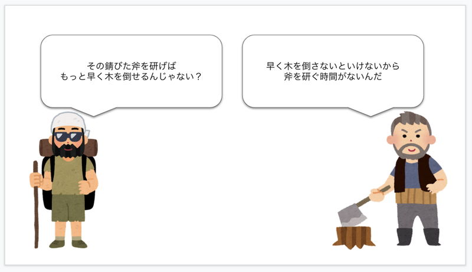
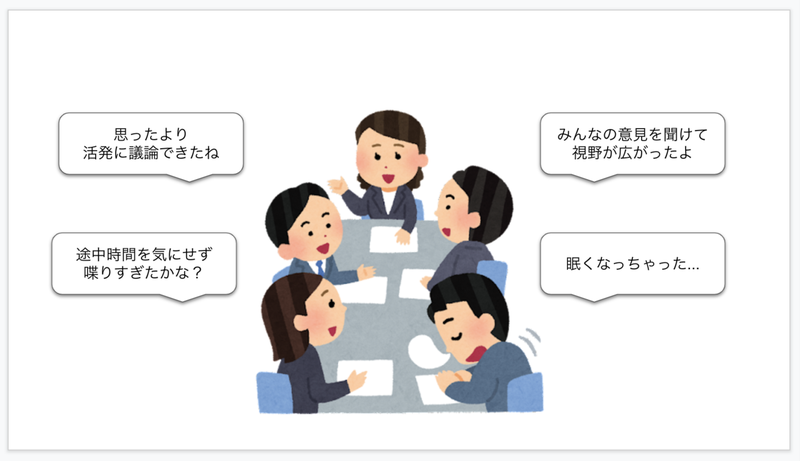
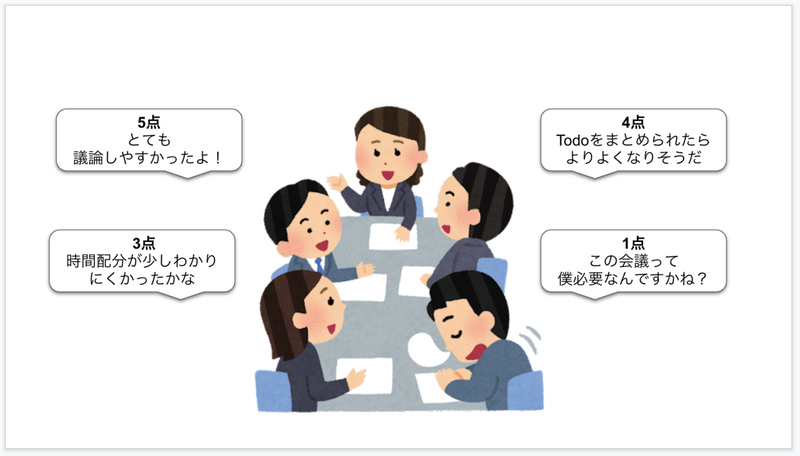
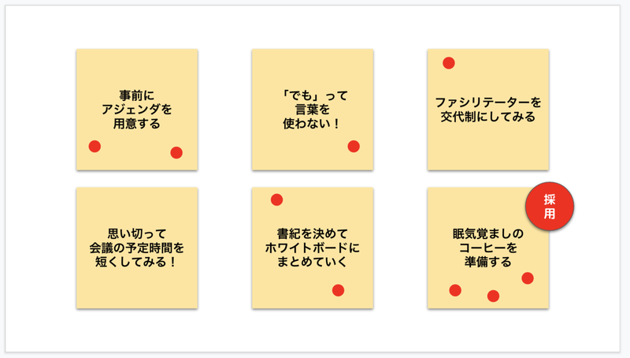
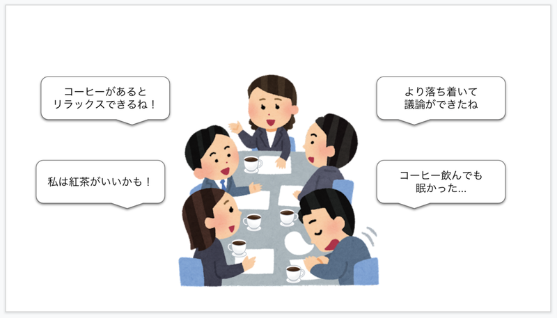

この記事は[ふりかえりAdvent Calendar 2021](https://adventar.org/calendars/6327) ６日目の記事です。

みなさん、ふりかえり会してますか？
した方がいいとは思ってるんだけど、会議会議でそんな時間とれないよ。そんな方も多いのではないでしょうか。

この記事ではそんなふりかえり会をする時間もないほど会議に明け暮れているチームに、チェックアウトをご紹介したいと思います。

## 木こりのジレンマ

まず、ふりかえりは大事です。改善することで今よりも効果的かつ効率的な活動ができることに疑う余地はないです。

しかし、実際には会議に明け暮れて一日が終わり、さらにふりかえり会なんて開けない！って方もいると思います。あの会議が無駄、この会議が効率悪い、となんとなく思っていても、それを改善するためのふりかえり会の時間が取れず、まさに木こりのジレンマに陥ってはいないでしょうか？

> あるところに木こりがいました。
> 木こりは錆びた斧で必死に木を倒そうとしています。
> 旅人が通りかかり、木こりに「その斧の錆を取ったらすぐに木を倒せるんじゃないかい？」と言いました。
> 木こりは「それはわかっているんだけど、この木を早く倒さなくちゃいけないから錆を取る暇がないんだよ。」と答えました。

木こりのジレンマはだいたいこんな話。

## ならばチェックアウトから始めよう

木こりのジレンマの話は、「木を倒すことに専念する」or「錆を取ることに専念する」の極端な二択感があるなって思ってまして。
ちょっと錆を取ればちょっと木を倒すのが早くなって、そのちょっとのゆとりを使ってまたちょっと錆を取ればまたちょっと木を倒すのが早くなって…この繰り返しでいつか錆のない斧で爆速倒木するのが最適解なんじゃないかなーって思うんですよね。

そこでおすすめしたいのが**チェックアウト**です。
チェックアウトは会議の最後に少しの時間（5分程度）を使って行うアクティビティの総称です。
ふりかえり会と違って、既存の会議のちょっとの時間でちょっとの改善をしていこうってイメージですね。
決まった型があるわけではないので、目的別に自由にカスタマイズできます。

**会議の最後の5分くらいなら気軽に始められそうですよね！ね！**

この記事では、実際に僕がやっているチェックアウトを少しご紹介します。

## Checkout 1：感想戦

参加者ひとりひとりに今回の会議の感想を言ってもらうだけのチェックアウトです。
目的は参加者の満足度向上と理解度向上。
最後にひとこと感想や自分の理解を述べるだけで参加した感が倍増するんですよね。

ファシリテーターとしては、この感想の中からフォローアップが必要なところや次回の会議でやり方を工夫できそうなところなどを発見するチャンスにもなります。
「最後にひとことずつ感想を教えてください。では〇〇さんからお願いします。」って言うだけでできるので、手軽さも魅力です。

感想を言ってもらう前に1-2分時間を取って、付箋やmiro、google docsなど共有できるものに書き出してもらうのも効果的です。
後から見返して思い出すこともできるので、一石二鳥感があります。

## Checkout 2：5段階評価

参加者ひとりひとりに、今回の会議を5段階評価してもらいます。できればその評価にした理由も共有してもらいましょう。
目的は会議が改善されてきているかどうかを定量的に見ることです。定期的に開催する会議などに打ってつけですね。
評価の理由から改善点が発見できるはず。毎回何か１つか２つ改善を入れて、評価が上がれば継続、下がれば見直し、といった具合に会議をよりよくできるチェックアウトです。

5段階評価の出し方は、せーので指で出し合ってもいいですし、miroに1,2,3,4,5の付箋を用意してドットを置いてもらったりしてもいいですね。

## Checkout 3：改善ブレスト

参加者で次同じような会議をやるとしたらどんな改善ができそうかブレストするチェックアウトです。
目的はズバリ会議の改善。あとはふりかえり会の予行練習にもなると思います。

1-2分時間をとって、参加者に今回の会議で次回までに改善できそうなことを付箋やmiroにブレストしてもらいます。
その後一言ずつ共有してもらい、1人1票投票してもらいます。一番票が多かったアイデアを次回取り入れてみましょう。

これは5分だとバタバタしてしまうかもしれませんので、適宜7分とか10分とか、時間は参加者数などによって変えています。
共有の時間は設けず字面だけで投票してもらったり、投票は行わず次のファシリテーターが独断と偏見でアイデアを採用することもあります。

また、「改善点」だと殺伐としそう…という場合は、逆に「続けたい良かったところ」をブレストしてもらうと面白いです。
会議の最後はポジティブに終わりたいですもんね。改善点を出すことよりも参加者の気持ちを優先させて使い分けましょう！

## Checkout 4：今回の改善のふりかえり

Checkout1-3によって、改善点を取り入れた会議をしたならば、その改善点のふりかえりもやっていきましょう。やりっぱなしは良くないです。効果のない改善はやめたいですもんね。

やり方はCheckout1-3と同様で、テーマが「今回の改善どうだった？」に変わるだけです。
僕は会議の最初に今回取り入れた改善点を共有して、チェックアウトの時間に「これからも継続したい」「次もう一度試してみたい」「次は別の実験をしたい」の3つの選択肢から投票してもらってます。「これから〜」が多ければグランドルールに、「次もう一度〜」が多ければ次回も試す、「次は別の〜」が多ければ改善前に戻して新しいアイデアを見つけるためのチェックアウトに移る、といった具合です。

## まとめ

こんな感じで会議の最後に少しの時間を使ってチェックアウトすることで、会議を気持ちよく終えられますし、既存の会議がどんどんよくなります。既存の会議に余裕が出れば、ふりかえり会を開催する余裕も生まれて、もっと広い視野でチームを改善するチャンスを作り出すことができるはずです。

会議に明け暮れて木こりのジレンマに陥ってしまっているなら、まずはチェックアウトから始めてみてはいかがでしょうか！
